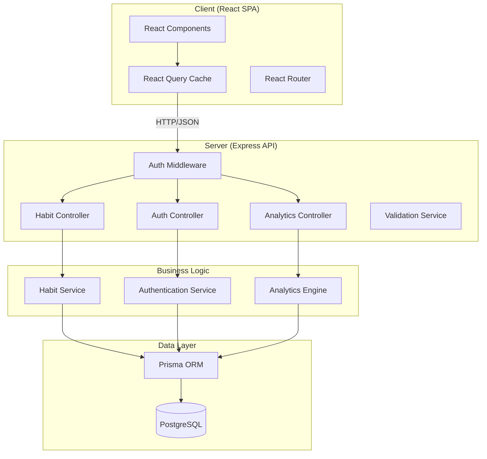
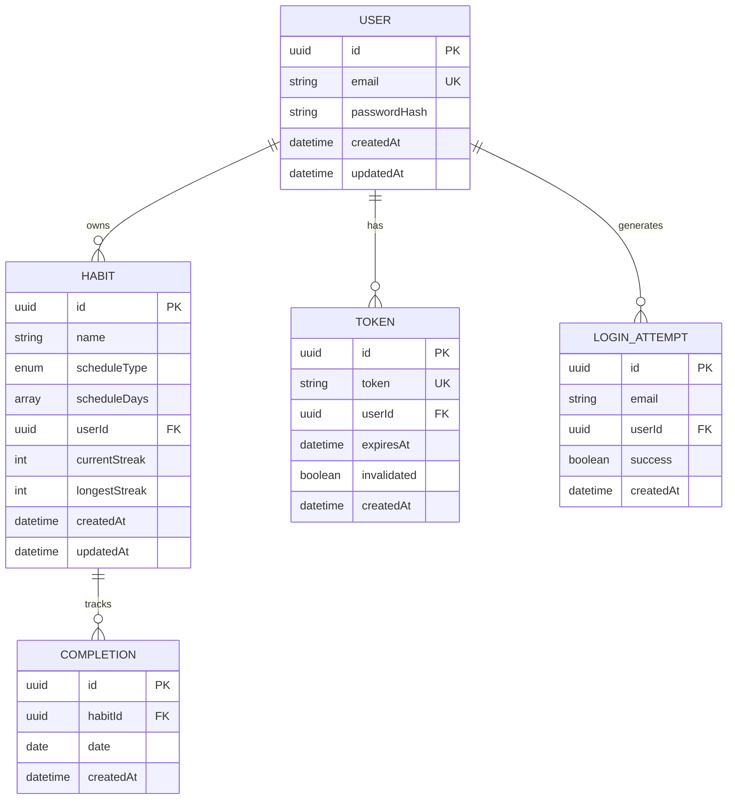

# Design Document

## Overview

The Habit Tracker is a full stack web application that enables users to create, manage, and monitor personal habits with the goal of building long-term consistency. The system provides user authentication, habit CRUD operations, completion tracking, streak calculation, consistency metrics, and progress visualization through a responsive dashboard.

### Technology Stack

| Layer | Technology | Rationale |
|-------|-----------|-----------|
| Frontend | React 18 + TypeScript | Component-based UI with strong typing for maintainability |
| Styling | Tailwind CSS | Utility-first CSS for responsive design across 320px-2560px |
| State Management | React Query (TanStack Query) | Server state caching, optimistic updates for completion toggling |
| Charts | Recharts | Lightweight charting library for heatmaps and line charts |
| Backend | Node.js + Express + TypeScript | Shared language with frontend, strong ecosystem |
| Database | PostgreSQL | Relational integrity for User→Habit→Completion relationships |
| ORM | Prisma | Type-safe database access with migration support |
| Authentication | JWT (jsonwebtoken) + bcrypt | Stateless auth tokens with secure password hashing |
| Testing | Vitest + fast-check | Unit/integration testing with property-based testing support |
| Build | Vite | Fast development builds for the React frontend |

### Key Design Decisions

1. **Monorepo structure** — Frontend and backend live in the same repository under `client/` and `server/` directories for simplified development and deployment.
2. **JWT with server-side invalidation** — Tokens are stored in a database table to support logout invalidation and account lockout, trading pure statelessness for security requirements.
3. **Synchronous streak recalculation** — Streaks are recalculated on each completion change rather than via background jobs, keeping the system simple and meeting the 1-second requirement.
4. **PostgreSQL over NoSQL** — The data model has strong relational constraints (User→Habit→Completion) making a relational database the natural fit.

## Architecture



### Request Flow

1. User interacts with React UI
2. React Query sends HTTP request to Express API
3. Auth middleware validates JWT token (except for login/register)
4. Controller validates input and delegates to service layer
5. Service layer executes business logic
6. Prisma ORM performs database operations
7. Response flows back through the layers
8. React Query caches response and updates UI

### Directory Structure

```
habit_tracker/
├── client/
│   ├── src/
│   │   ├── components/       # Reusable UI components
│   │   ├── pages/            # Route-level page components
│   │   ├── hooks/            # Custom React hooks
│   │   ├── services/         # API client functions
│   │   ├── types/            # TypeScript type definitions
│   │   └── utils/            # Utility functions
│   ├── package.json
│   └── vite.config.ts
├── server/
│   ├── src/
│   │   ├── controllers/      # Route handlers
│   │   ├── services/         # Business logic
│   │   ├── middleware/       # Auth, validation, error handling
│   │   ├── validators/       # Input validation schemas
│   │   ├── types/            # TypeScript type definitions
│   │   └── utils/            # Utility functions
│   ├── prisma/
│   │   └── schema.prisma     # Database schema
│   ├── package.json
│   └── tsconfig.json
└── package.json              # Root workspace config
```

## Components and Interfaces

### API Endpoints

#### Authentication

| Method | Path | Auth | Description |
|--------|------|------|-------------|
| POST | `/api/auth/register` | No | Create new user account |
| POST | `/api/auth/login` | No | Authenticate and receive token |
| POST | `/api/auth/logout` | Yes | Invalidate current token |

#### Habits

| Method | Path | Auth | Description |
|--------|------|------|-------------|
| GET | `/api/habits` | Yes | List all habits for current user |
| POST | `/api/habits` | Yes | Create a new habit |
| PUT | `/api/habits/:id` | Yes | Update an existing habit |
| DELETE | `/api/habits/:id` | Yes | Delete a habit and its completions |

#### Completions

| Method | Path | Auth | Description |
|--------|------|------|-------------|
| POST | `/api/habits/:id/completions` | Yes | Mark habit complete for a date |
| DELETE | `/api/habits/:id/completions/:date` | Yes | Unmark habit completion for a date |

#### Analytics

| Method | Path | Auth | Description |
|--------|------|------|-------------|
| GET | `/api/habits/:id/analytics` | Yes | Get streak and consistency metrics |
| GET | `/api/analytics/dashboard` | Yes | Get dashboard summary data |
| GET | `/api/habits/:id/heatmap` | Yes | Get 12-month heatmap data |
| GET | `/api/analytics/weekly-summary` | Yes | Get weekly completion summary |

### Service Interfaces

```typescript
// Authentication Service
interface IAuthenticationService {
  register(email: string, password: string): Promise<{ user: User; token: string }>;
  login(email: string, password: string): Promise<{ user: User; token: string }>;
  logout(token: string): Promise<void>;
  validateToken(token: string): Promise<User | null>;
}

// Habit Service
interface IHabitService {
  create(userId: string, data: CreateHabitInput): Promise<Habit>;
  update(userId: string, habitId: string, data: UpdateHabitInput): Promise<Habit>;
  delete(userId: string, habitId: string): Promise<void>;
  getAll(userId: string): Promise<Habit[]>;
  getById(userId: string, habitId: string): Promise<Habit | null>;
}

// Completion Service
interface ICompletionService {
  markComplete(userId: string, habitId: string, date: string): Promise<Completion>;
  unmarkComplete(userId: string, habitId: string, date: string): Promise<void>;
  getCompletions(habitId: string, startDate: string, endDate: string): Promise<Completion[]>;
}

// Analytics Engine
interface IAnalyticsEngine {
  calculateStreak(habitId: string): Promise<StreakResult>;
  calculateConsistency(habitId: string, window: TimeWindow): Promise<number>;
  getDashboardSummary(userId: string): Promise<DashboardSummary>;
  getHeatmapData(habitId: string): Promise<HeatmapEntry[]>;
  getWeeklySummary(userId: string): Promise<WeeklySummary>;
}
```

### Input/Output Types

```typescript
// Habit creation/update
interface CreateHabitInput {
  name: string;                    // 1-100 chars after trim
  schedule: HabitSchedule;
}

interface UpdateHabitInput {
  name?: string;
  schedule?: HabitSchedule;
}

type HabitSchedule =
  | { type: 'daily' }
  | { type: 'weekly'; days: DayOfWeek[] };  // 1-7 days

type DayOfWeek = 'monday' | 'tuesday' | 'wednesday' | 'thursday' | 'friday' | 'saturday' | 'sunday';

// Analytics results
interface StreakResult {
  currentStreak: number;
  longestStreak: number;
}

interface DashboardSummary {
  habits: DashboardHabit[];
  allCompletedToday: boolean;
}

interface DashboardHabit {
  id: string;
  name: string;
  schedule: HabitSchedule;
  todayStatus: 'completed' | 'incomplete' | 'not_scheduled';
  currentStreak: number;
}

type TimeWindow = '7d' | '30d' | 'all';

interface HeatmapEntry {
  date: string;          // ISO date string
  level: 0 | 1 | 2 | 3 | 4;  // 0%, 1-25%, 26-50%, 51-75%, 76-100%
}

interface WeeklySummary {
  days: { date: string; completedCount: number; totalScheduled: number }[];
}
```

### Frontend Components

```
App
├── AuthLayout
│   ├── LoginPage
│   └── RegisterPage
├── AppLayout (authenticated)
│   ├── Sidebar / BottomNav (responsive)
│   ├── DashboardPage
│   │   ├── HabitList
│   │   │   └── HabitCard (completion toggle, streak display)
│   │   ├── CompletionIndicator
│   │   └── EmptyState
│   ├── HabitDetailPage
│   │   ├── HabitForm (create/edit)
│   │   ├── ConsistencyMetrics
│   │   ├── CalendarHeatmap
│   │   └── ConsistencyLineChart
│   └── AnalyticsPage
│       ├── WeeklySummaryChart
│       └── OverallStats
```

## Data Models

### Database Schema (Prisma)

```prisma
model User {
  id            String    @id @default(uuid())
  email         String    @unique
  passwordHash  String
  createdAt     DateTime  @default(now())
  updatedAt     DateTime  @updatedAt
  habits        Habit[]
  tokens        Token[]
  loginAttempts LoginAttempt[]
}

model Token {
  id          String    @id @default(uuid())
  token       String    @unique
  userId      String
  user        User      @relation(fields: [userId], references: [id], onDelete: Cascade)
  expiresAt   DateTime
  invalidated Boolean   @default(false)
  createdAt   DateTime  @default(now())

  @@index([token])
  @@index([userId])
}

model LoginAttempt {
  id        String    @id @default(uuid())
  email     String
  userId    String?
  user      User?     @relation(fields: [userId], references: [id], onDelete: Cascade)
  success   Boolean
  createdAt DateTime  @default(now())

  @@index([email, createdAt])
}

model Habit {
  id            String       @id @default(uuid())
  name          String
  scheduleType  ScheduleType
  scheduleDays  DayOfWeek[]  @default([])
  userId        String
  user          User         @relation(fields: [userId], references: [id], onDelete: Cascade)
  currentStreak Int          @default(0)
  longestStreak Int          @default(0)
  createdAt     DateTime     @default(now())
  updatedAt     DateTime     @updatedAt
  completions   Completion[]

  @@index([userId])
}

model Completion {
  id        String   @id @default(uuid())
  habitId   String
  habit     Habit    @relation(fields: [habitId], references: [id], onDelete: Cascade)
  date      DateTime @db.Date
  createdAt DateTime @default(now())

  @@unique([habitId, date])
  @@index([habitId, date])
}

enum ScheduleType {
  DAILY
  WEEKLY
}

enum DayOfWeek {
  MONDAY
  TUESDAY
  WEDNESDAY
  THURSDAY
  FRIDAY
  SATURDAY
  SUNDAY
}
```

### Entity Relationships



## Correctness Properties

*A property is a characteristic or behavior that should hold true across all valid executions of a system — essentially, a formal statement about what the system should do. Properties serve as the bridge between human-readable specifications and machine-verifiable correctness guarantees.*

### Property 1: Password validation correctness

*For any* string, the password validator SHALL accept it if and only if the string is between 8 and 128 characters long and contains at least one uppercase letter, at least one lowercase letter, and at least one digit.

**Validates: Requirements 1.3, 1.5**

### Property 2: Email case-insensitive uniqueness

*For any* registered email address and any case variation of that email, attempting to register with the case variation SHALL be rejected as a duplicate.

**Validates: Requirements 1.2**

### Property 3: Login error message opacity

*For any* login attempt with either an unregistered email or an incorrect password, the Authentication_Service SHALL return the same generic error message regardless of which credential was wrong.

**Validates: Requirements 2.2**

### Property 4: Habit name and schedule validation

*For any* string and schedule configuration, the Habit_Service SHALL accept the habit creation/update if and only if the trimmed name is between 1 and 100 characters and the schedule is either daily or weekly with 1-7 days selected.

**Validates: Requirements 4.2, 4.3, 4.4, 4.6, 5.4, 5.5**

### Property 5: Completion date range validation

*For any* date, the Habit_Service SHALL accept a completion record if and only if the date is not in the future and not more than 7 days in the past (inclusive of today and the day 7 days ago).

**Validates: Requirements 7.4**

### Property 6: Completion round trip

*For any* habit and valid date, marking the habit as complete and then unmarking it SHALL result in no completion record existing for that habit and date — returning to the original state.

**Validates: Requirements 7.1, 7.2**

### Property 7: Streak calculation correctness

*For any* habit with a defined schedule and a set of completion records, the calculated current streak SHALL equal the number of consecutive scheduled periods (counting backward from the most recent scheduled period before or including today) that each have at least one completion, and the longest streak SHALL always be greater than or equal to the current streak.

**Validates: Requirements 8.2, 8.3, 8.4, 8.5**

### Property 8: Consistency rate calculation

*For any* habit with a defined schedule, a creation date, and a set of completion records, the consistency rate for a given time window SHALL equal the number of scheduled periods with at least one completion divided by the total number of scheduled periods within that window (clamped to the habit's creation date), multiplied by 100 and rounded to one decimal place. If there are zero scheduled periods, the rate SHALL be 0%.

**Validates: Requirements 9.1, 9.2, 9.3, 9.5**

### Property 9: Schedule change preserves completions

*For any* habit with existing completion records, changing the habit's schedule SHALL preserve all existing completion records (no completions are deleted or modified).

**Validates: Requirements 5.2**

### Property 10: Heatmap density level classification

*For any* completion percentage value, the heatmap SHALL classify it as level 0 for 0%, level 1 for 1-25%, level 2 for 26-50%, level 3 for 51-75%, and level 4 for 76-100%.

**Validates: Requirements 11.1**

### Property 11: Password hashing with unique salts

*For any* two passwords (including identical passwords), hashing each SHALL produce distinct hash values, and no hash SHALL equal its plaintext input.

**Validates: Requirements 14.4**

### Property 12: Token authentication enforcement

*For any* protected API endpoint and any request with a missing, malformed, or expired token, the Application SHALL return a 401 Unauthorized response without processing the request.

**Validates: Requirements 14.1, 14.2**

## Error Handling

### Backend Error Strategy

| Error Type | HTTP Status | Response Format | User-Facing Message |
|-----------|-------------|-----------------|---------------------|
| Validation Error | 400 | `{ error: "VALIDATION_ERROR", fields: [...] }` | Specific field errors |
| Authentication Error | 401 | `{ error: "UNAUTHORIZED" }` | "Please log in to continue" |
| Authorization Error | 403 | `{ error: "FORBIDDEN" }` | "You don't have access to this resource" |
| Not Found | 404 | `{ error: "NOT_FOUND", resource: "..." }` | "Resource not found" |
| Conflict (duplicate) | 409 | `{ error: "CONFLICT", message: "..." }` | Specific conflict message |
| Account Locked | 423 | `{ error: "ACCOUNT_LOCKED", retryAfter: seconds }` | "Account locked, try again later" |
| Server Error | 500 | `{ error: "INTERNAL_ERROR" }` | "Something went wrong, please try again" |
| Timeout | 504 | `{ error: "TIMEOUT" }` | "Request timed out, please try again" |

### Error Handling Patterns

```typescript
// Global error handler middleware
function errorHandler(err: AppError, req: Request, res: Response, next: NextFunction) {
  // Log full error internally
  logger.error(err);
  
  // Return sanitized error to client (never expose stack traces or internal details)
  res.status(err.statusCode).json({
    error: err.code,
    message: err.userMessage,
    fields: err.fields ?? undefined,
  });
}
```

### Frontend Error Handling

- **Network errors**: Display toast notification with retry option
- **401 responses**: Clear auth state, redirect to login
- **403 responses**: Display "access denied" message
- **Validation errors (400)**: Display inline field-level error messages
- **Server errors (500)**: Display generic error toast with "try again" option
- **Timeout errors**: Display timeout message with retry option
- **Optimistic update failures**: Revert UI state and display error toast

### Database Error Handling

- All write operations use database transactions to ensure atomicity
- Failed transactions are rolled back completely (no partial state)
- Connection pool exhaustion triggers a 503 response with retry-after header
- Unique constraint violations (duplicate email, duplicate completion) return 409

## Testing Strategy

### Testing Framework

- **Unit & Integration Tests**: Vitest
- **Property-Based Tests**: fast-check (via Vitest)
- **Frontend Component Tests**: Vitest + React Testing Library
- **E2E Tests**: Playwright (optional, for critical flows)

### Property-Based Testing Configuration

Each property test runs a minimum of **100 iterations** using fast-check. Tests are tagged with their corresponding design property:

```typescript
// Example tag format
// Feature: habit-tracker, Property 7: Streak calculation correctness
```

### Test Organization

```
server/
├── src/
│   ├── services/__tests__/
│   │   ├── auth.service.test.ts          # Unit tests for auth logic
│   │   ├── auth.service.property.test.ts # Property tests for password/email validation
│   │   ├── habit.service.test.ts         # Unit tests for habit CRUD
│   │   ├── habit.service.property.test.ts # Property tests for habit validation
│   │   ├── completion.service.test.ts    # Unit tests for completions
│   │   ├── completion.service.property.test.ts # Property tests for completion logic
│   │   ├── analytics.service.test.ts     # Unit tests for analytics
│   │   └── analytics.service.property.test.ts # Property tests for streak/consistency
│   ├── middleware/__tests__/
│   │   └── auth.middleware.test.ts       # Token validation tests
│   └── validators/__tests__/
│       └── validators.property.test.ts   # Property tests for all validators
client/
├── src/
│   ├── components/__tests__/             # Component unit tests
│   └── pages/__tests__/                  # Page-level integration tests
```

### Test Coverage Goals

| Layer | Coverage Target | Test Types |
|-------|----------------|------------|
| Validators (password, email, habit name, schedule, date range) | 100% | Property-based (100+ iterations each) |
| Analytics Engine (streak, consistency, heatmap) | 100% | Property-based + unit tests |
| Service Layer (auth, habit, completion) | 90% | Unit + integration tests |
| Controllers | 80% | Integration tests |
| Frontend Components | 80% | Component tests |
| E2E Critical Paths | Login, create habit, mark complete | Playwright |

### Property Test Mapping

| Property | Test File | Generator Strategy |
|----------|-----------|-------------------|
| P1: Password validation | `validators.property.test.ts` | Random strings (0-200 chars), mix of character classes |
| P2: Email uniqueness | `auth.service.property.test.ts` | Random emails with case variations |
| P3: Login error opacity | `auth.service.property.test.ts` | Random credentials (some valid, some invalid) |
| P4: Habit validation | `validators.property.test.ts` | Random strings (0-200 chars) + random schedule configs |
| P5: Date range validation | `validators.property.test.ts` | Random dates across wide range |
| P6: Completion round trip | `completion.service.property.test.ts` | Random habits + valid dates |
| P7: Streak calculation | `analytics.service.property.test.ts` | Random schedules + random completion patterns |
| P8: Consistency rate | `analytics.service.property.test.ts` | Random schedules + completions + time windows |
| P9: Schedule change preserves completions | `habit.service.property.test.ts` | Random habits with completions + new schedules |
| P10: Heatmap density | `analytics.service.property.test.ts` | Random percentages (0-100) |
| P11: Password hashing | `auth.service.property.test.ts` | Random password pairs |
| P12: Token enforcement | `auth.middleware.test.ts` | Random malformed token strings + expired tokens |

### Unit Test Focus Areas

- Account lockout after 5 failed attempts (Req 2.5)
- Token expiration at 24 hours (Req 2.3)
- Cascade deletion of habit + completions (Req 6.1)
- Duplicate completion rejection (Req 7.3)
- Dashboard empty state (Req 10.6)
- Insufficient chart data message (Req 11.4)
- Database timeout handling (Req 13.5)
- Referential integrity enforcement (Req 13.4)

